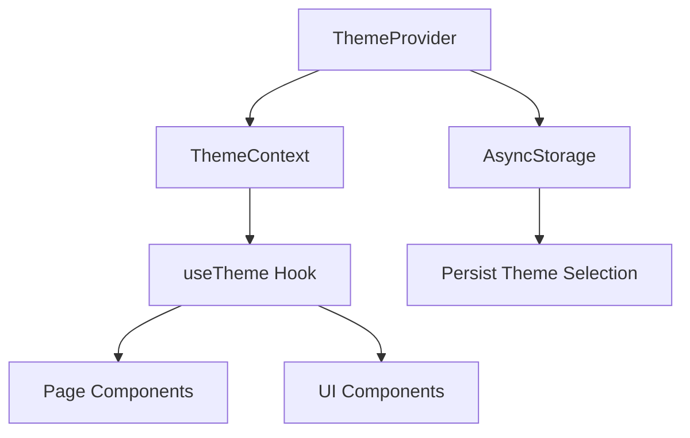
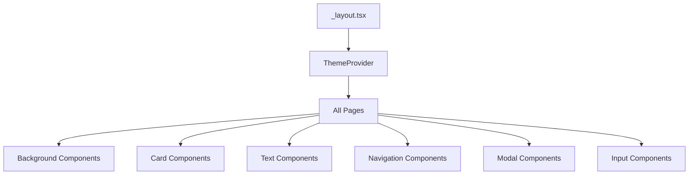

# Dark Theme Implementation Plan

## Overview

This document outlines the implementation plan for adding a dark theme to the AIDE health monitoring application. The dark theme will be selectable from the Personalização page and will persist across app sessions.

## Design Specifications

### Dark Theme Colors

| Element | Light Theme | Dark Theme |
|---------|-------------|------------|
| Background | `#ECF5FF` (solid) | Linear gradient: `#000720` (left) to `#000746` (right) |
| Cards | `#FFFFFF` (white) | `#000412` at 90% opacity |
| Primary Text | `#000000` (black) | `#FFFFFF` (white) |
| Secondary Text | `#000000` at 60-80% opacity | `#FFFFFF` at 60-80% opacity |
| Blue accent text (stress, tempo, passos) | Stays the same | Stays the same |
| Blue buttons/accents | Stays the same | Stays the same |

### Color Values for Implementation

```javascript
// Dark theme specific colors
darkBackground: {
  gradient: ['#000720', '#000746'],  // Left to right
},
darkCard: 'rgba(0, 4, 18, 0.9)',  // #000412 at 90% opacity
darkText: '#FFFFFF',
darkSecondaryText: 'rgba(255, 255, 255, 0.6)', // 60% opacity
darkTertiaryText: 'rgba(255, 255, 255, 0.8)', // 80% opacity
```

## Architecture

### 1. Theme Context Structure



### 2. Component Hierarchy



## Implementation Steps

### Step 1: Create Theme Context and Provider

**File:** `app/contexts/ThemeContext.tsx`

Create a React Context that:
- Stores the current theme state (light/dark)
- Provides a function to toggle the theme
- Persists the theme selection to AsyncStorage
- Loads the saved theme on app startup

```typescript
// Key structure
interface ThemeContextType {
  isDark: boolean;
  theme: 'light' | 'dark';
  toggleTheme: () => void;
  setTheme: (theme: 'light' | 'dark') => void;
}
```

### Step 2: Update Tailwind Configuration

**File:** `app/tailwind.config.js`

Add dark theme colors to the Tailwind config:

```javascript
colors: {
  // Existing colors...
  
  // Dark theme colors
  'aide-dark-bg-start': '#000720',
  'aide-dark-bg-end': '#000746',
  'aide-dark-card': 'rgba(0, 4, 18, 0.9)',
  'aide-dark-text': '#FFFFFF',
}
```

### Step 3: Create useTheme Hook

**File:** `app/hooks/useTheme.ts`

A convenience hook that returns theme-aware values:

```typescript
interface UseThemeReturn {
  isDark: boolean;
  theme: 'light' | 'dark';
  colors: {
    background: string | [string, string]; // or gradient
    card: string;
    text: string;
    secondaryText: string;
  };
  toggleTheme: () => void;
}
```

### Step 4: Update Background Components

**Files to modify:**
- `app/components/DotBackground.tsx`
- `app/components/GradientBackground.tsx`

Changes needed:
- Accept a theme prop or use the ThemeContext
- Switch between light gradient and dark gradient
- Update dot pattern color for dark mode (white dots on dark background)

### Step 5: Update Personalização Page

**File:** `app/app/personalizacao.tsx`

Changes needed:
- Connect to ThemeContext
- Persist theme selection when user taps Escuro/Claro
- Update the page's own styling to respond to theme changes

### Step 6: Update Page Components

**Files to modify:**
- `app/app/index.tsx` - Landing page
- `app/app/login.tsx`
- `app/app/register.tsx`
- `app/app/definicoes.tsx`
- `app/app/perfil.tsx`
- `app/app/gerir_perfil.tsx`
- `app/app/dispositivos.tsx`
- `app/app/historicoDiario.tsx`
- `app/app/healthData.tsx`
- `app/app/extraData.tsx`
- `app/app/recommendations.tsx`
- `app/app/selectConditions.tsx`
- `app/app/associar.tsx`
- `app/app/complete-profile.tsx`
- `app/app/terms-of-service.tsx`
- `app/app/recover-password.tsx`
- `app/app/MasterDetail.tsx`

For each page:
- Replace `bg-aide-background` with theme-aware background
- Replace `bg-white` cards with theme-aware card background
- Replace `text-black` with theme-aware text color
- Keep blue text colors unchanged

### Step 7: Update Card/Container Components

**Files to modify:**
- `app/components/profilecard.tsx`
- `app/components/elemento_definicao.tsx`
- `app/components/details/main.tsx`
- `app/components/widgets/WidgetWrapper.tsx`
- `app/components/widgets/DashboardMetricWidget.tsx`

### Step 8: Update Navigation Components

**Files to modify:**
- `app/components/navBar/NavBar.tsx`
- `app/components/navBar/TopTitleNav.tsx`
- `app/components/topBar/TopBar.tsx`

### Step 9: Update Modal Components

**Files to modify:**
- `app/components/modals/BottomModal.tsx`
- `app/components/modals/AddDeviceModal.tsx`
- `app/components/modals/DeviceConnectionModal.tsx`
- `app/components/modals/DeviceManagementModal.tsx`
- `app/components/modals/AssociarConfirmationModal.tsx`
- `app/components/modals/CuidadoModal.tsx`
- `app/components/modals/addWidgetModal.tsx`

### Step 10: Update Input Components

**Files to modify:**
- `app/components/input/Input.tsx`
- `app/components/input/SearchBar.tsx`
- `app/components/input/RegisterForm.tsx`
- `app/components/input/QRcode.tsx`

### Step 11: Update Button Components

**Files to modify:**
- `app/components/buttons/button.tsx`
- `app/components/buttons/backButton.tsx`
- `app/components/buttons/ChipButton.tsx`
- `app/components/buttons/calendarButton.tsx`
- `app/components/buttons/choseCuidado.tsx`
- `app/components/buttons/socialButton.tsx`
- `app/components/buttons/widgetAdd.tsx`

## Implementation Pattern

### For Background Colors

```tsx
// Before
<View className="bg-aide-background">

// After
import { useTheme } from '@/hooks/useTheme';

const { isDark } = useTheme();

<View style={isDark ? darkGradientBackground : lightBackground}>
```

### For Card Backgrounds

```tsx
// Before
<View className="bg-white rounded-[20px]">

// After
<View 
  className="rounded-[20px]"
  style={{ backgroundColor: isDark ? 'rgba(0, 4, 18, 0.9)' : '#FFFFFF' }}
>
```

### For Text Colors

```tsx
// Before
<Text className="text-black">

// After
<Text className={isDark ? "text-white" : "text-black"}>
```

### For Blue Text (Keep Unchanged)

```tsx
// These stay the same regardless of theme
<Text className="text-aide-normal-blue">Stress</Text>
<Text className="text-aide-light-blue">Tempo</Text>
<Text className="text-aide-dark-blue">Passos</Text>
```

## Files to Create

1. `app/contexts/ThemeContext.tsx` - Theme context and provider
2. `app/hooks/useTheme.ts` - Convenience hook for theme access
3. `app/components/DarkBackground.tsx` - Dark theme background component

## Files to Modify

### Core Setup
- `app/app/_layout.tsx` - Wrap with ThemeProvider
- `app/tailwind.config.js` - Add dark theme colors

### Background Components
- `app/components/DotBackground.tsx`
- `app/components/GradientBackground.tsx`

### Pages (15 files)
- All page files in `app/app/`

### Components (25+ files)
- All component files in `app/components/`

## Testing Checklist

- [ ] Theme persists after app restart
- [ ] All pages display correctly in dark mode
- [ ] All cards have correct dark background with 90% opacity
- [ ] All dark text changes to white
- [ ] Blue accent text remains unchanged
- [ ] Navigation bar displays correctly in both themes
- [ ] Modals display correctly in dark mode
- [ ] Input fields display correctly in dark mode
- [ ] Buttons display correctly in dark mode
- [ ] Smooth transition when switching themes
- [ ] No visual glitches or overlapping text

## Dependencies

The project already has:
- `@react-native-async-storage/async-storage` - For persisting theme
- `expo-linear-gradient` - For gradient backgrounds
- `nativewind` - For Tailwind CSS styling

No additional dependencies are required.

## Estimated Scope

- **New files:** 3
- **Modified files:** ~40
- **Lines of code:** ~500-800 new/modified lines

## Notes

1. The dark theme gradient should use `LinearGradient` from `expo-linear-gradient`
2. Card opacity can be achieved using `rgba(0, 4, 18, 0.9)` 
3. Some components already have `isDarkVariant` props - these should be connected to the global theme
4. The personalizacao page already has theme selection UI - just needs to be connected to the context